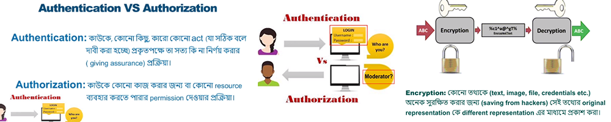

 <h1 style="color:red;" align="center">React Authentication</h1>

 
 
> ## Additional providers----booking.com
- Simple React Firebase Authentication(google,github,facebook)
- **react-firebase-hooks(Easy authentication=> google,github,facebook)
  - Github Source code(==):-*[Source code](https://github.com/julfiker755/2023-authentication-google-facebook-github)*
>  ## Native providers
- simple firebase Email and Password Firebase Authentication(Toggle signIn/Register ,Varify Email,Forget Password,Update user)
- **react-firebase-hooks(Easy authentication=>Toggle signIn/Register ,Varify Email,Forget Password,Update user
  - Github Source code(==):-*[Source code](https://github.com/julfiker755/2023-authentication-Email-and-password)*
- Simple-wepsite+ context-api(nav menu show,requireauth,proteted pagelog)
   - Context api(==):-*[Source code](https://github.com/julfiker755/2023-simple-wepsite-context-api)*
   - Firebase-hooks-authentication(==):-*[Source code](https://github.com/julfiker755/2023-simple-wepsite-react-firebase-hooks)*
 - Ema-jhon-wepsite Login,Register,Privatepage
   - Firebase-hooks(==):-*[Source code](https://github.com/julfiker755/2023-ema-jhon-wepsite-login-register-private)*
> ## Programming Hero new batch 8
- batch-8 simple firebase Email and Password Firebase Authentication(Toggle signIn/Register ,Varify Email,Forget Password,Update user)+*[Source code](https://github.com/julfiker755/batch-8-email-and-pasword-authentication/tree/main)*
- Simple + context-api(nav menu show,Private,sign in,register,logout) + *[Source code](https://github.com/julfiker755/batch8-signin-signup-logout/tree/main)*
- Assignmnet 9 + *[Source code](https://github.com/julfiker755/assignment9/)+[Live Link](https://assignment9-bccfb.web.app/)*

  
  
> ## old Document
- Firebase_Provider(customLink,old proteted page,etc)(==)Github Source code:-*[Source code](https://github.com/julfiker755/Firebase_Provider)*
- CustomHook_Firebase(==)Github Source code:-*[Source code](https://github.com/julfiker755/CustomHook_Firebase)*

